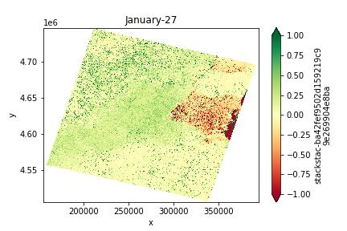
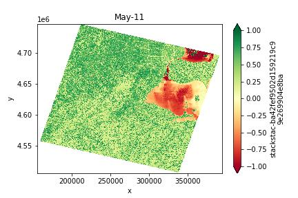
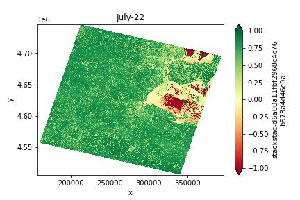

**Featured Project: The Green Pulse**
Seasonal NDVI Analysis of the Toledo Region

### Winter Baseline
The year begins with low biological activity.

### The Spring Green-up
By May, we see a significant shift in the spectral signature.

### Peak Summer Vigor
The rural fringe reaches maximum saturation by late July. Note: **Alga

This project quantifies the "biological pulse" of Northwest Ohio by analyzing seasonal vegetation dynamics across urban and rural zones.

**The Challenge:** Processing multi-temporal NDVI plots without embedded geographic metadata.

**The Solution:** Developed a custom Python pipeline using NumPy-based image segmentation to isolate specific Regions of Interest (ROI) and normalize intensity values into a temporal index.

**Key Insight:** Quantified a $600\%$ increase in rural biomass from winter to peak summer, contrasting against the lower "NDVI ceiling" of the urban core due to the Urban Heat Island effect.
