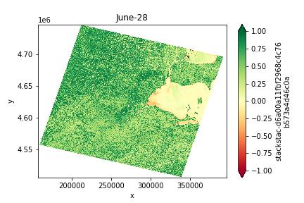
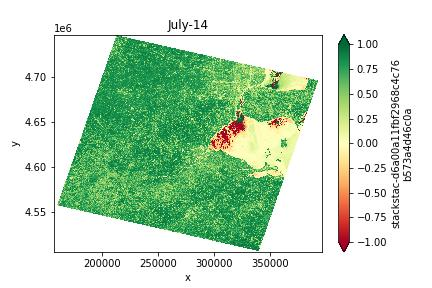

# **Featured Project: The Green Pulse**

Seasonal NDVI Analysis of the Toledo Region using Landsat-8 data.

### Winter Baseline
The year begins with low biological activity.

In the January plot, the region is almost entirely pale yellow, with NDVI values hovering near $0.1$ or $0.2$. This is the landscape at rest. Interestingly, by March 08, you can see the Maumee Bay and river system turn a deep, dark red.Interpretation: This isn't "negative" health; it’s the signature of water and potentially melting ice. Water absorbs near-infrared light, leading to those very low or negative NDVI values, which helps map the hydrology of the region perfectly.

### The Spring Green-up
By May, we see a significant shift in the spectral signature.

May shows the most dramatic transition. The pale yellows have been replaced by a light, consistent green across the entire scene.

Interpretation: This is the "Green-up" phase. The deciduous trees in the Oak Openings and residential areas are leafing out, and the winter wheat or early cover crops are hitting their stride. The city of Toledo itself remains a lighter shade because of the "gray" infrastructure (roads and buildings) mixed with the greenery.

### Peak Summer Vigor
The rural fringe reaches maximum saturation by late July.

By June 28, the landscape has "saturated." The greens are deep and dark (NDVI $> 0.75$), especially in the agricultural fields surrounding the city.The July Story: If you compare July 14 to July 22, you can see the peak of biological productivity. This is the height of the corn and soybean season.Urban Heat Island: Notice how the Toledo city center (that "notch" on the western edge of the lake) stays a lighter green/yellow compared to the deep green of the rural fields. This clearly shows the difference between managed urban lawns/parks and the high-density biomass of the surrounding farmland.

**Algal bllom activity alert!!**

July-14 --> July-22: The red patches in the water seem to shift slightly in shape. This could be capturing the movement of sediment plumes from the Maumee River or potentially the early stages of algal activity in the western basin of Lake Erie, which often shows up in remote sensing data during the hot summer months.

**The Challenge:** Processing multi-temporal NDVI plots without embedded geographic metadata.

**The Solution:** Developed a custom Python pipeline using NumPy-based image segmentation to isolate specific Regions of Interest (ROI) and normalize intensity values into a temporal index.

**Key Insight:** Quantified a $600\%$ increase in rural biomass from winter to peak summer, contrasting against the lower "NDVI ceiling" of the urban core due to the Urban Heat Island effect.
